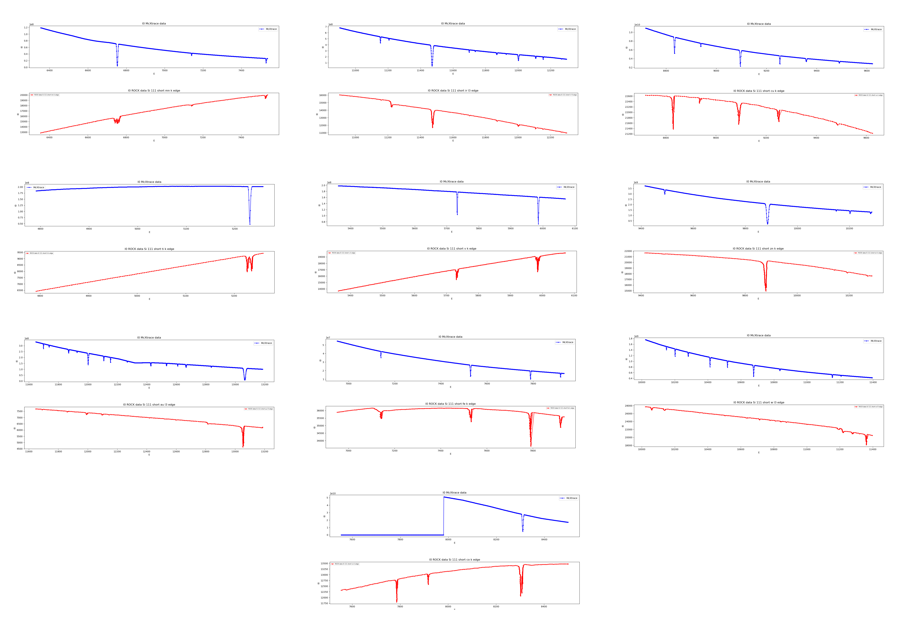

# Glitch runner SOLEIL ROCK

This jupyter notebook aims to recreate the glitches found on SOLEIL's ROCK beamline. The picture below shows ROCK's I0 plots (in red) and the McXtrace plots (in blue) for their Si 111 short crystal.    
Two details are worth mentionning.   
The dip in intensity in ROCK's data for the Ir plot at the 11215 eV mark which is the L-III edge for Ir, it is not a glitch. This comes from the use of a mirror with Ir coating.     
For the co k edge plot, McXtrace shows a clear discontinuity at the 7980 eV mark, which is caused by the switch of the coating used on the harmonics rejection mirror.    

Created by Stéphane Bac and Antoine Padovani.  
Many thanks for their precious help to the entire team of ROCK at SOLEIL, Emmanuel Farhi, Mads Bertelsen, Peter Willendrup and Erik Knudsen.
